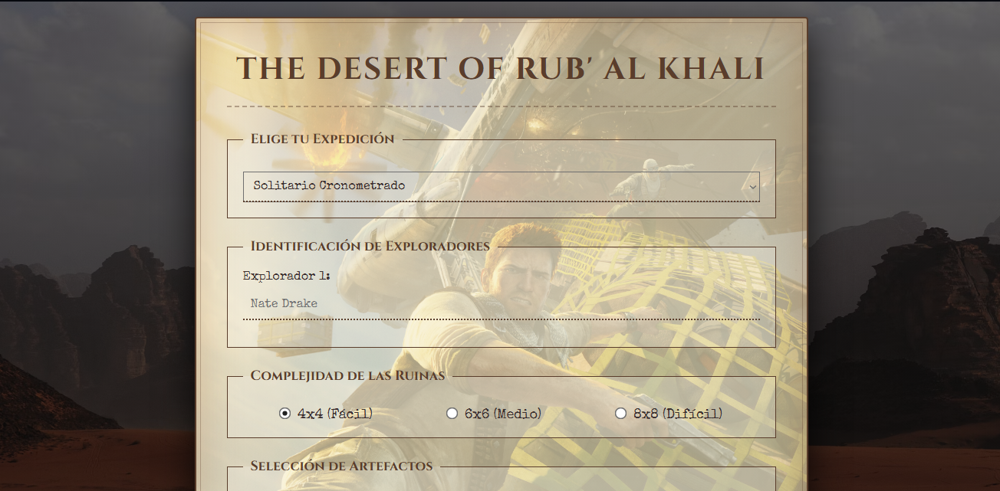
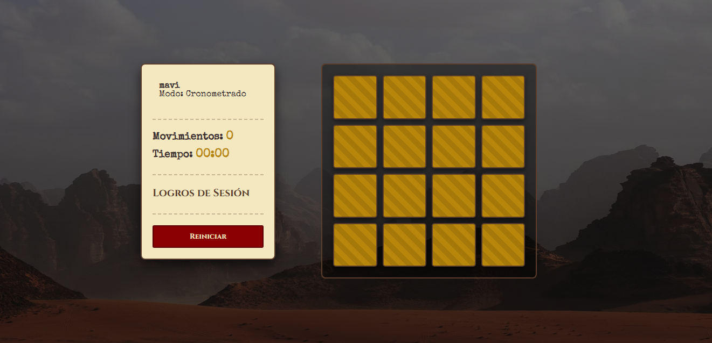
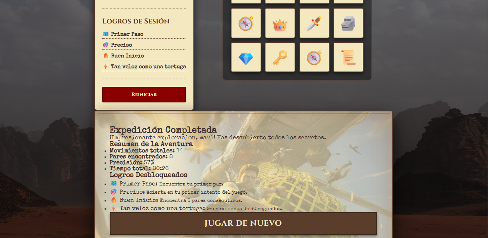

# The Desert of Rub' al Khali #

The Desert of Rub' al Khali es un proyecto que consiste en un juego de memoria con temática de exploración y arqueología. Fue desarrollado con Html, Css y Vanilla Js por Eric Vargas y Santiago Carrasquero.

# Características y Modos de Juego 

Este proyecto cuenta con distintas mecánicas diseñadas para ofrecer una experiencia interactiva completa:

-Tableros Dinámicos: Generación procedimental de la cuadrícula de juego con tres niveles de dificultad adaptables: Fácil (4x4), Medio (6x6) y Difícil (8x8).
-Modo Solitario (Contrarreloj o Tiempo cronometrado): Un modo de juego individual donde el usuario debe descubrir todos los pares mientras un sistema de temporizador y un contador de movimientos registran su velocidad y su precision.
-Modo Jugador vs Jugador (PvP Local): Permite a dos usuarios competir en la misma pantalla. Si uno de los dos falla al intentar escoger un par, se cede el turno hacia el otro jugador y se incrementan sus movimientos en la partida.
- Sistema de Logros: notificaciones asíncronas en tiempo real (estilo playstation) que recompensan al jugador por hitos específicos, como lograr rachas de aciertos o ganar en un tiempo determinado.

# Temáticas Implementadas #

El juego incluye un catálogo de iconos visuales que se usan dinámicamente en las cartas:
* **Artefactos y Reliquias:** Elementos que representan tesoros antiguos, herramientas de expedición y misterios arqueológicos (ej. 💎 Diamantes, 👑 Coronas, 🏺 Vasijas, 🗺️ Mapas, 🗡️ Dagas).

## Logros Implementados

Lista de trofeos que se pueden desbloquear durante la sesión según el rendimiento del jugador:
-🗺️ Primer Paso: Se desbloquea al encontrar el primer par de cartas en la partida.
- 🔥 Buen Inicio: Se obtiene al encontrar 3 pares de forma consecutiva sin equivocarse.
- 🎯 Preciso: Se otorga al acertar un par en el primerísimo intento del juego.
- ⚡ Tan veloz como una tortuga: Se desbloquea exclusivamente si el jugador logra limpiar todo el tablero y el cronómetro se detiene en 30 segundos o menos.

 # Capturas de Pantalla de la Aplicacion #





# Division de Tareas #

Este proyecto fue desarrollado de manera colaborativa, dividimos el trabajo de la siguiente manera (aclarando la participacion de los dos en el proyecto entero, pero dividiendonos las responsabilidades):

  Eric Vargas:
  * Desarrollo del documento principal (`index.html`), estilo de pagina y su respectiva tematica (`css/styles.css`) y (`assets`).
  * Programación de `app.js` (coordinacion del estado global del juego), `themes.js` (catalogos y base de datos de iconos), `game.js` (logica matemática, emparejamiento de cartas y demas validaciones) y por ultimo el `board.js`.

  Santiago Carrasquero:
  * Desarrollo de la logica de interfaz de inicio y cierre (`menu.js`, `endScreen.js`).
  * Programación del temporizador asíncrono (`timer.js`), el sistema de reglas y control de turnos (`modes.js`), y la evaluacion y renderizado de trofeos (`achievements.js`).

# Instrucciones para Clonar y Ejecutar #

# Clonar repositorio #

Abrir el terminal, powershell o command prompt y ejecutar el siguiente comando:

```bash
git clone https://github.com/bannedcx/Clientes-Web.git
y para usar el programa solo debemos acceder al directorio que seria:
cd Clientes-Web
